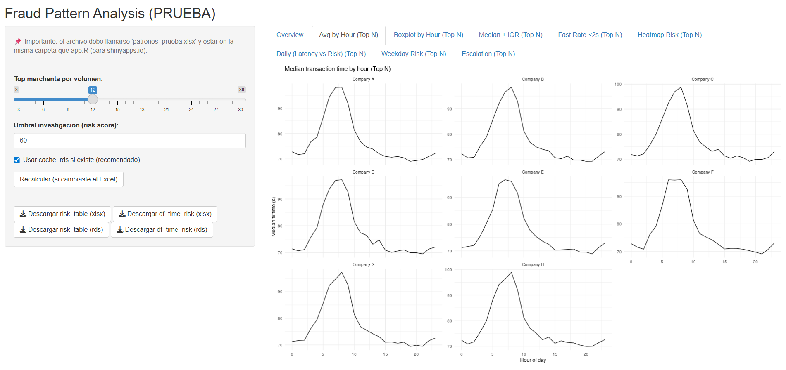
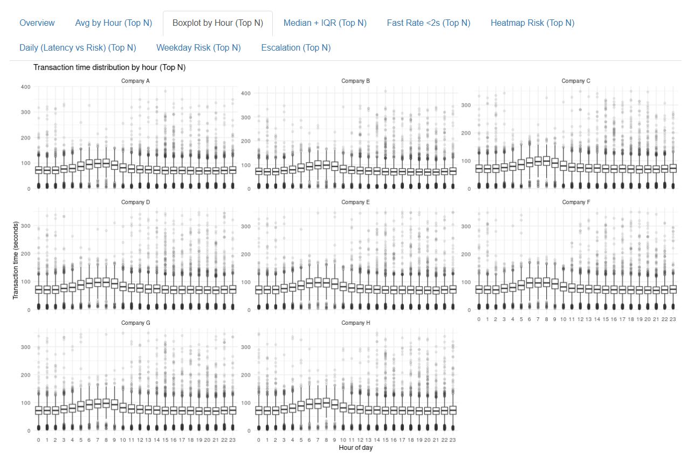
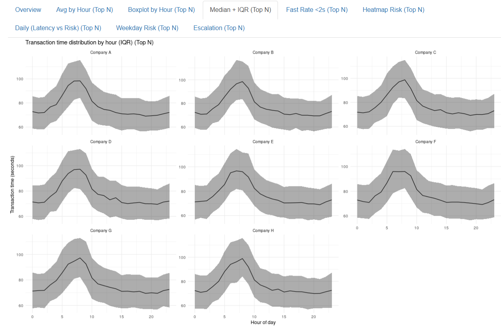
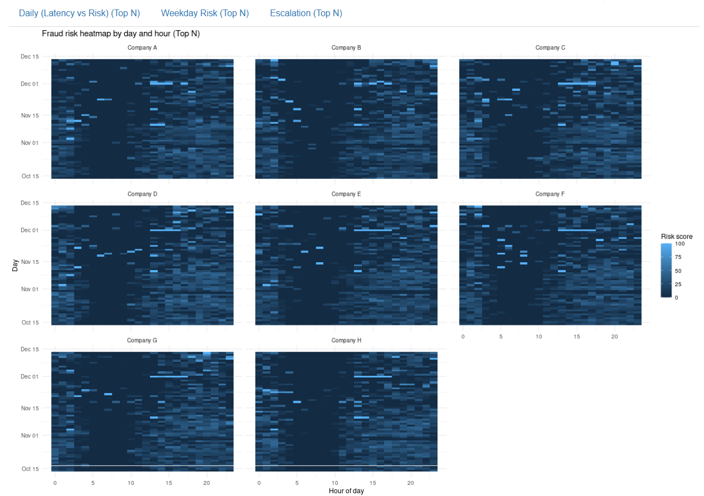
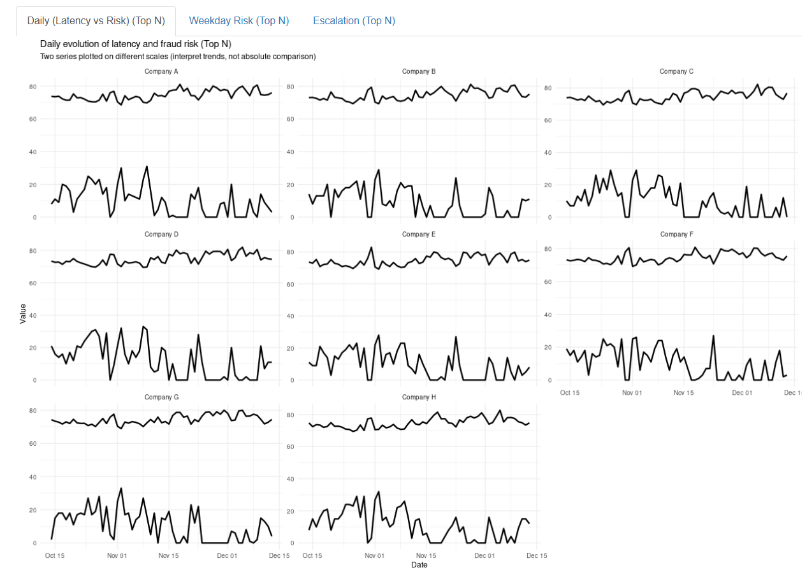
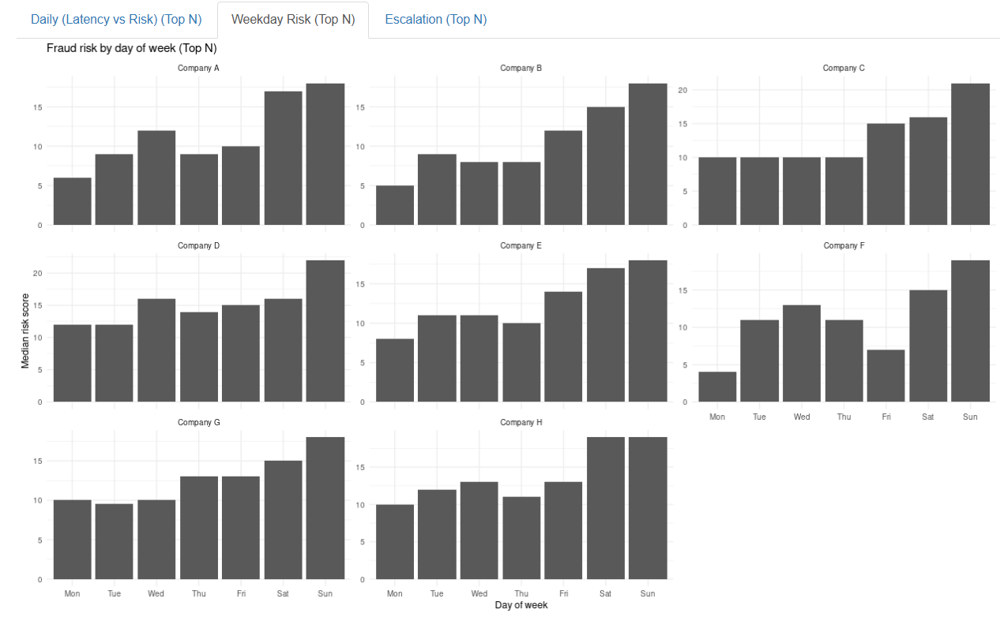
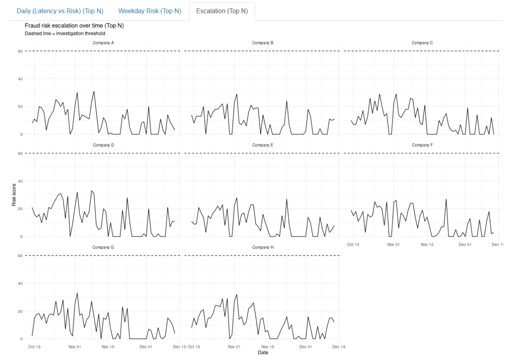

# 🛡️ Compliance & Fraud Dashboard (Shiny)

**Fraud Pattern Detection in Subscription-Based Digital Services**

🔗 **Live Dashboard:**  
https://latency-fraud-analysis.shinyapps.io/fraud_latency_test/

---

## 📌 Project Overview

This project shows how **potential fraud patterns** can be detected in **digital subscription services** (Telco / VAS type environments) using **latency analysis and statistical comparison**.

The analysis is based on **simulated data covering around 3 months**, for one country and multiple merchants.  
The project is inspired by **real compliance and antifraud monitoring scenarios**, but **no real data is used**.

⚠️ **Disclaimer**  
All data in this project is **fully simulated** and created only for portfolio and learning purposes.  
No real customers, companies, or transactions are included.

---

## 🎯 Business Problem

In digital subscription flows, fraud usually does not appear as a single abnormal event.  
Instead, it appears as **behavioral patterns**, such as:

- interactions that are **too fast**
- behavior that is **too consistent**
- repeated actions with **enough volume**

The challenge is to detect these patterns **early**, without using fixed rules that generate many false positives.

---

## 🧠 Core Concepts

### 1️⃣ Latency

**Latency** is the time (in seconds) between when a user enters a landing page and when the first valid interaction happens.

Latency is calculated as: Latency = First_Query_Timestamp − Landing_Page_Time

**Normal latency**
- irregular and variable
- wide dispersion (p25–p75)
- different across users and merchants  
→ typical human behavior

**Suspicious latency**
- unusually fast
- very consistent
- repeated many times  
→ possible automation (bots, scripts, induced flows)

---

### 2️⃣ Fraud Risk (Risk Score)

This project does **not label fraud directly**.

Instead, it calculates a **risk score (0–100)** that shows **how abnormal the behavior is**, compared to the **merchant’s own historical behavior**.

This makes the approach:
- adaptive
- explainable
- useful for compliance and operations teams

---

## 🔬 Methodology (Why this works)

### Merchant-specific baseline

Instead of fixed rules like *“latency < 2 seconds = fraud”*, the dashboard builds a **baseline for each merchant**, including:
- typical median latency
- variability (IQR / dispersion)
- typical proportion of very fast transactions

Each **day × hour block** is compared to this baseline using **statistical deviation (z-scores)**.

---

### Signals used

Fraud risk increases when:
- median latency is much lower than normal
- the proportion of very fast transactions (<2s) is high
- transaction volume is large enough to avoid random noise

---

### Why not averages?

Averages are not enough because:
- they are affected by outliers
- fraud behavior is asymmetric
- bots usually create extreme and stable patterns  

For this reason, the dashboard uses:
- medians
- IQR
- z-scores
- fast-event rates  

This approach is closer to **real antifraud analysis**, not only academic theory.

---

## 🏢 Analysis by Company (Merchant-Level)

The analysis in this project is performed **per company (merchant)**, not at a global level.

Each company has its own:
- user behavior
- subscription flow
- typical latency
- natural variability

For this reason, companies are **never compared directly using absolute values**.  
Each company is evaluated **relative to its own historical behavior**.

### Company-level patterns observed

**Company A**  
Shows stable latency most of the time, with isolated short periods of faster interactions.  
Risk remains low except for specific day–hour blocks with increased fast-rate.

**Company B**  
Has generally faster latency due to a simpler flow, but shows normal dispersion.  
Low risk overall, demonstrating that **fast does not mean fraudulent by itself**.

**Company C**  
Exhibits clear risk spikes driven by **high fast-rate and reduced variability**, especially during specific hours.  
This pattern is consistent with possible automation bursts.

**Company D**  
Displays moderate latency but unusually tight IQR in certain periods.  
Risk increases are driven more by **consistency** than by absolute speed.

**Company E**  
Shows irregular behavior with alternating normal and high-risk windows.  
This suggests episodic activity rather than constant anomalous behavior.

**Company F**  
Has low transaction volume most of the time.  
Risk is rarely escalated due to volume filters, preventing false positives.

**Company G**  
Presents higher risk during weekends, with repeated ultra-fast interactions.  
This aligns with common fraud patterns observed outside standard business hours.

**Company H**  
Maintains stable and well-dispersed latency across all periods.  
Serves as a strong example of **normal human behavior baseline**.

### Why company-level analysis matters

A latency value that is normal for one company may be abnormal for another.

For example:
- a fast onboarding flow can be normal for Company B
- the same latency could be suspicious for Company C if it deviates strongly from its own history

This approach:
- avoids unfair comparisons
- reduces false positives
- adapts to different business models

---

## 📊 Dashboard Structure

The Shiny dashboard is designed for **monitoring and investigation** and includes the following views:

- **Overview** – General configuration and context
- **Avg by Hour (Top N)** – Average transaction time by hour
- **Boxplot by Hour (Top N)** – Latency distribution and stability
- **Median + IQR (Top N)** – Robust central value and dispersion
- **Fast Rate <2s (Top N)** – Share of very fast interactions
- **Heatmap Risk (Top N)** – Risk hotspots by day and hour
- **Daily (Latency vs Risk) (Top N)** – Relationship between latency and risk over time
- **Weekday Risk (Top N)** – Risk patterns by day of week
- **Escalation (Top N)** – Priority list for investigation

---

## 📊 Dashboard Examples

### Average transaction time by hour
Shows the typical daily latency pattern for each merchant.



---

### Transaction time distribution (Boxplot)
Highlights latency dispersion and stability by hour.



---

### Median latency and IQR
Shows robust central tendency (median) and variability (IQR).



---

### Fraud risk heatmap (day × hour)
Identifies concentrated risk hotspots over time.



---

### Daily latency vs risk
Shows how latency and risk evolve together over time.



---

### Fraud risk by weekday
Compares median risk levels across days of the week.



---

### Escalation view
Shows the highest-risk segments prioritized for investigation.



---

## ✅ Conclusion (Based on Dashboard Results)

The dashboard shows **clear and consistent behavior patterns** that support the use of **latency analysis** as an early signal of possible fraud or automation.

Latency becomes a meaningful fraud signal **only when evaluated relative to each company’s own historical behavior**, and when confirmed by repetition and sufficient volume.

This method reduces false positives and reflects how **real compliance and antifraud teams** prioritize investigations in production environments.

---

## ▶️ How to Run Locally

```r
install.packages(c("shiny", "dplyr", "ggplot2", "lubridate", "tidyr", "readxl"))
shiny::runApp()

